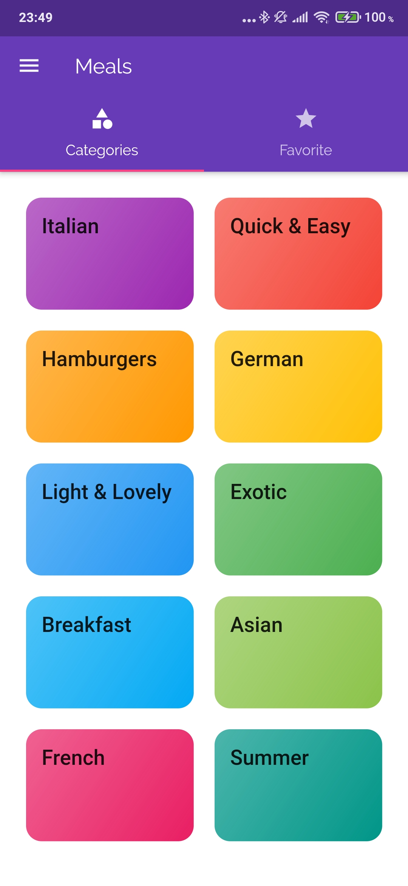
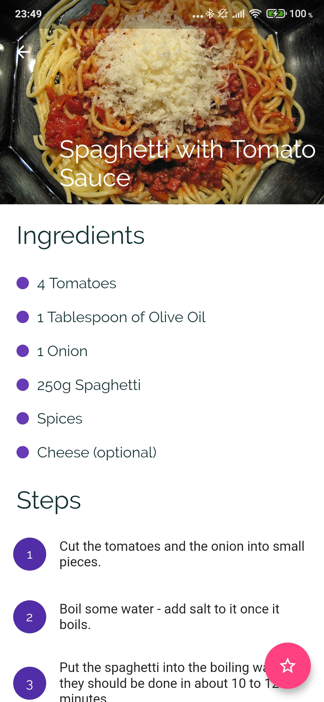
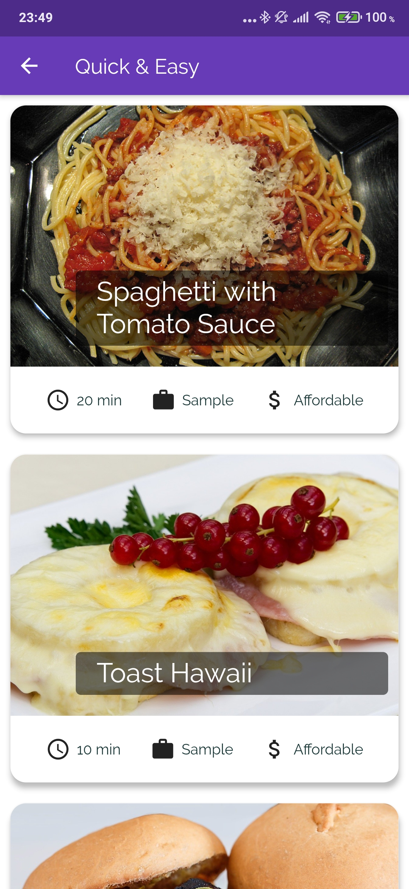

<h1 align="center"> DeliMeals </h1>

<p align="center">
  <a href="#-project">Project</a>&nbsp;&nbsp;&nbsp;|&nbsp;&nbsp;&nbsp;
  <a href="#rocket-technologies">Technologies</a>&nbsp;&nbsp;&nbsp;|&nbsp;&nbsp;&nbsp;
  <a href="#information_source-how-to-run">How to run</a>&nbsp;&nbsp;&nbsp;|&nbsp;&nbsp;&nbsp;
  <a href="#-how-to-contribute">How to contribute</a>&nbsp;&nbsp;&nbsp;
  
</p>

<br>

<p align="center">
  
  
  
</p>

## 💻 Project

This app is just a project i made to help me to learn about some flutter's features and widgets like CustomScrollView, SliverAppBar and others. 


## :rocket: Technologies

This app was made using the following technologies:
- [Flutter][flutter]
- [Dart][dart]

## :information_source: How To Run

To clone and run this application, you'll need [Git](https://git-scm.com) + [Flutter][flutter] installed on your computer.

### Clone and Run 

```bash
# Clone this repository
$ git clone https://github.com/lucastssb/deliMeals-app.git

# Go into the repository
$ cd deliMeals-app/

# Install dependencies
$ flutter pub get

# Run 
$ flutter run

```

## 🤔 How to contribute

-  Make a fork;
-  Create a branck with your feature: `git checkout -b my-feature`;
-  Commit changes: `git commit -m 'feat: My new feature'`;
-  Make a push to your branch: `git push origin my-feature`.

After merging your receipt request to done, you can delete a branch from yours.

<br>

Made with ♥ by Lucas Barbosa :wave: [Get in touch!](https://www.linkedin.com/in/lucas-barbosa-60b56416b/)


[flutter]: https://flutter.dev/
[dart]: https://dart.dev/